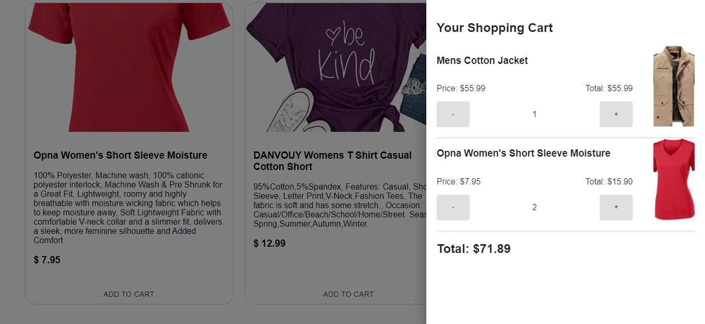

# Shopping Cart
Shopping cart using React, TypesScript and the Fake Store API

<h1 align="center">Shopping Cart</h1>

<p align="center">
  
</p>

## 💻 Project
Shopping cart using React, TypesScript and the Fake Store API.
- Live version coming soon.

## 🚀 Technologies
This project was developed with the following technologies:

- React JS
- TypeScript
- Material UI
- [Fake Store API](https://fakestoreapi.com/)

## 🏃 Running
To run this project you'll need:
- Node.js (v14.17.0)
- npm (v6.14.13)
- Terminal (like Git Bash)

After cloning/downloading the project, install the dependencies:
```
npm install
```

Run the app
```
npm start
```
